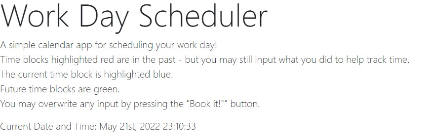

This is a Workday planner. 
A simple calendar app for scheduling your work day!

Time blocks highlighted red are in the past - but you may still input what you did to help track time.

The current time block is highlighted blue and tells you how much of the hour remains.

Future time blocks are green.

You may overwrite any input by pressing the "Book it!"" button.

All information is kept in local storage so inputs will remain until overwritten!